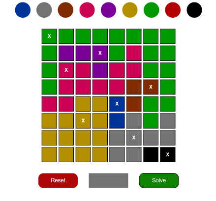

# N-Queen solver

#### Live : https://arun1118.github.io/nQueenSolver/

### Game Rules

1. ##### Chessboard Layout:
* The board is an 8×8 grid where each cell is assigned a color.

2. ##### Queen Placement:
* You must place exactly 8 queens on the board, where every color block should have a queen somewhere.
* Each row and each column must contain exactly one queen. This ensures no two queens share the same row or column.
* A queen cannot be placed in any cell that is immediately diagonally adjacent to another queen. In other words, for every queen, the four cells directly touching it on the diagonals (upper-left, upper-right, lower-left, lower-right) must be empty.
* Only one queen can occupy cells of the same color, i.e if multiple cells share the same color, only one of those cells will contain a queen.

### This Application will provide you the solution of the puzzle

#### Choose a color to fill the cell, complete the whole grid according to the given puzzle

or

*if you don't have a puzzle you can fill in this way, which is similar to basic nQueen problem*

#### Click on *__Solve__*

### The queens can be placed at the "X" position

